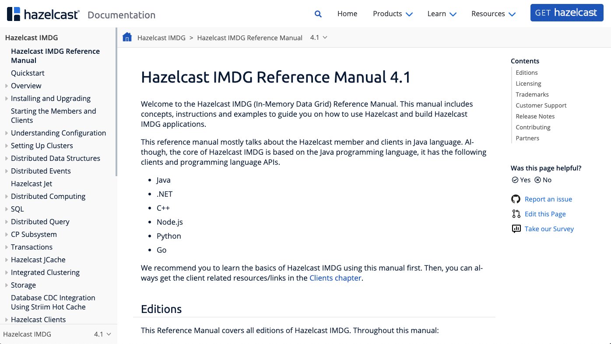

# Proof of Concept for the Hazelcast Docs Revamp

This repository hosts a modified [Antora](https://docs.antora.org/antora/2.3/) project that showcases a PoC of the new Hazelcast documentation.

As well as the default Antora UI, this repository includes:

- An extension for tabbed code blocks
- A [modified version of the `antora-default-generator`](https://github.com/Mogztter/antora-site-generator-lunr), which includes the code that generates a Lunr search index
- [A `supplemental_ui` component](https://github.com/Mogztter/antora-lunr#enable-the-search-component-in-the-ui) that implements a search bar for the Lunr search index



## Work in progress

This work is by no means finished. The current project includes a migrated copy of the Hazelcast IMDG reference manual, which is hosted in the `docs-poc-v1` branch in a fork of the [`hazelcast-reference-manual` repository](https://github.com/JakeSCahill/hazelcast-reference-manual).

The UI is styled with the latest Hazelcast HIVE design.

The roadmap includes the following items:

- [ ] Migrate Hazelcast Cloud content
- [ ] Migrate Jet content
- [ ] Migrate Management Center content
- [ ] Review and rewrite/restructure content, starting with IMDG

## Prerequisites

Antora requires an active long term support (LTS) release of Node.js. To check if you have Node.js installed, do the following:

```bash
node --version
```

If you see an active Node.js LTS version on your device, you’re ready to build the docs.

If no version number is displayed in the output, you need to [install Node.js](https://nodejs.org/en/download/).

## Build the docs locally

To build this project on your local device:

1. Clone the [`hazelcast-reference-manual` repository](https://github.com/JakeSCahill/hazelcast-reference-manual), and check out the `docs-poc-v1` branch

    ```bash
    git clone https://github.com/JakeSCahill/hazelcast-reference-manual
    cd hazelcast-reference-manual
    git checkout docs-poc-v1
    ```

2. Clone this repository

    ```bash
    cd ..
    git clone https://github.com/JakeSCahill/docs-poc
    cd docs-poc
    ```

3. Run the local build script

    ```bash
    npm i
    npm run-script build-local
    ```

You will see the following warnings:

```bash
asciidoctor: WARNING: migration_guides.adoc: line 1025: unterminated listing block
asciidoctor: WARNING: migration_guides.adoc: line 1043: unterminated listing block
```

These are yet to be fixed.

In the `docs` directory you will now have all the webpages for your documentation site.

## Host the docs

To view the documentation site from a localhost web server, run the `serve` script

    ```bash
    npm run-script serve
    ```

If you want to show the team your changes, you can expose your web server to the Internet, using ngrok by doing the following:

```bash
npm run-script expose
```

The public URL is displayed in the output:


